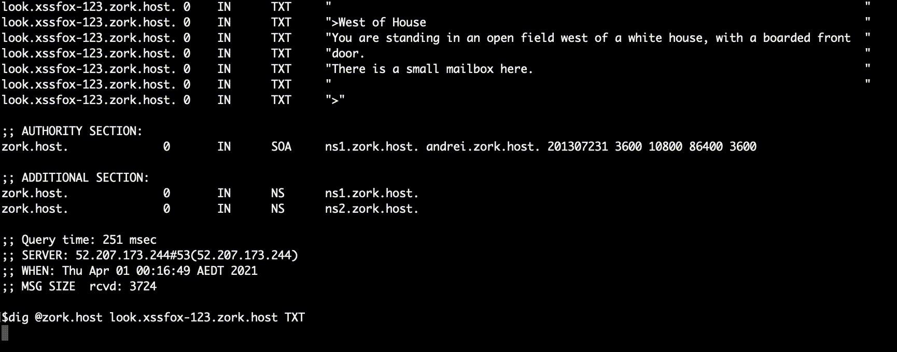

Zork DNS Server
===



zork dns server ran on zork.host and a player could play a game using the dig command (or any DNS inspection tool)

```sh
dig @zork.host look.{make up a name}.zork.host TXT
```

One could also build a simple client for it:
```sh
alias zork() { export ZORK_ID=${ZORK_ID-`uuidgen`}; while IFS= read -r line; do dig `tr -s ' ' '-' <<< $line`.$ZORK_ID.zork.host TXT @zork.host +short | xargs -0 -L1 printf | sed 's:^.\(.*\).$:\1:'; done}
```

In theory this server can likely work with many infocom z-machines, although the only tested game was zork.

This code is cobbled together as a quick expirement / art piece. It's not intended to be an example of good coding practises, or how to build things securely. 

The release of this source code is really more to preserve the piece, and give people a look into how it works behind the scenes.

Many thanks to GitHub user [theinternetftw](https://github.com/theinternetftw/xyppy) for building xyppy which made this idea possible and [paulc](https://github.com/paulc/dnslib) dnslib for python
